# تخت لایو — TakhtLive 📺

<p align="center">
  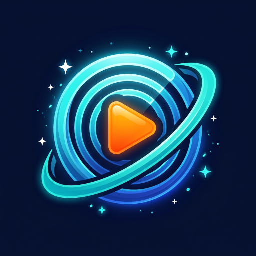
</p>

اپلیکیشن **پخش آنلاین کانال‌های ماهواره‌ای** برای **اندروید** و **ویندوز ۱۱**، با رابط کاربری فارسی و راست‌به‌چپ.

برنامه چهار بخش جداگانه دارد:

| بخش | تعداد کانال | نمونه‌ها |
|---|---|---|
| 📺 **پرشیانا گروپ** | ۲۶ | پرشیانا فمیلی، سریال، سینما، ایرانی، کره، کمدی، موزیک، فست، Nostalgia، MBC Persia |
| 📰 **خبری** | ۳۲ | BBC فارسی، ایران اینترنشنال، صدای آمریکا، رادیو فردا، **انقلاب ملی ایران**، **شبکه کلمه**، **اسرائیل فارسی**، الجزیره، CNN، DW |
| 🎵 **موزیک** | ۲۷ | PMC، رادیو جوان، آونگ، Vevo، MTV، XITE، Now 80s، Trace Urban، Deluxe |
| ⚽ **ورزشی** | ۲۴ | شبکه ورزش، beIN SPORTS، FIFA+، DAZN، رد بُل، تنیس چنل، گلف چنل، Fight Network |

**مجموع: ۱۰۹ کانال زنده**

فهرست کامل کانال‌ها: [docs/CHANNELS.md](docs/CHANNELS.md)

---

## 📸 تصاویر برنامه

این تصاویر خودکار از اجرای واقعی برنامه گرفته می‌شوند (تست روی JVM با Robolectric در GitHub Actions).

| صفحهٔ خانه | بخش پرشیانا گروپ |
|---|---|
| 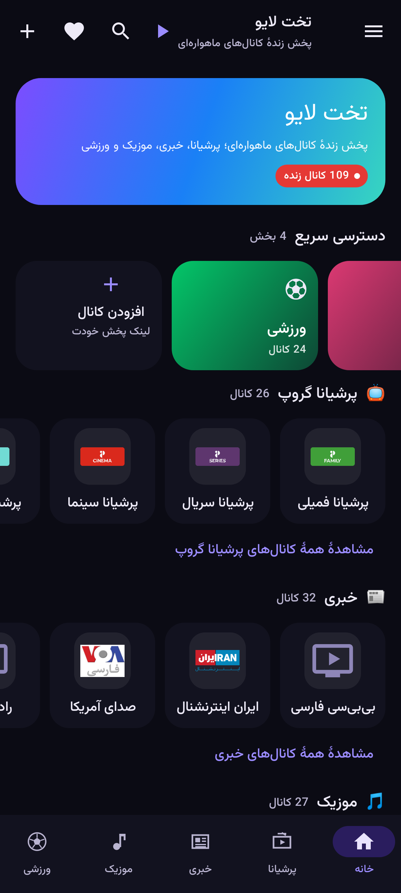 | 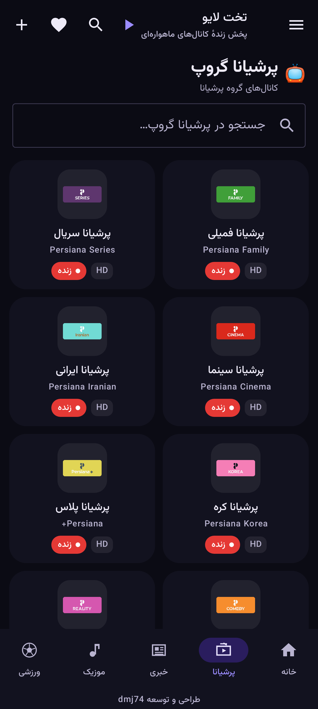 |

| بخش خبری | بخش موزیک |
|---|---|
| 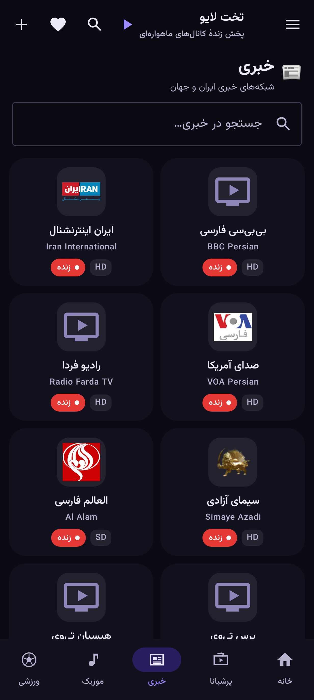 | 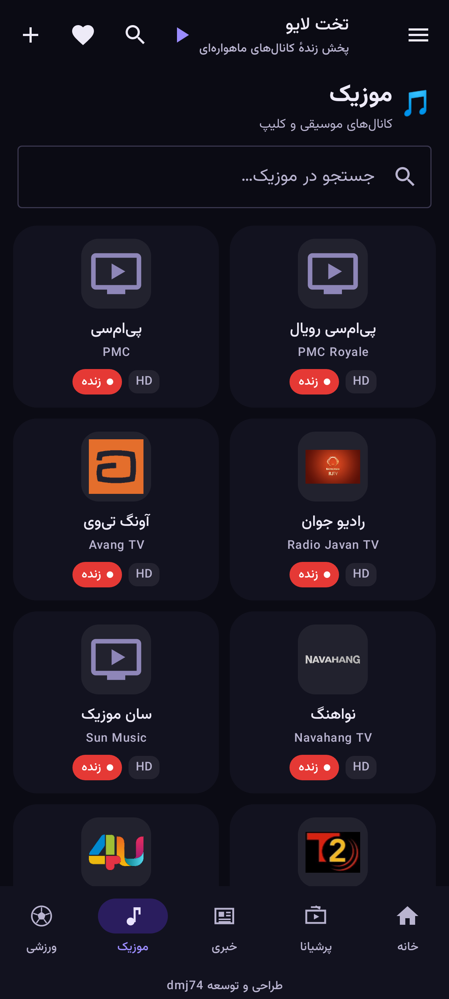 |

| بخش ورزشی | پخش‌کنندهٔ زنده |
|---|---|
|  | 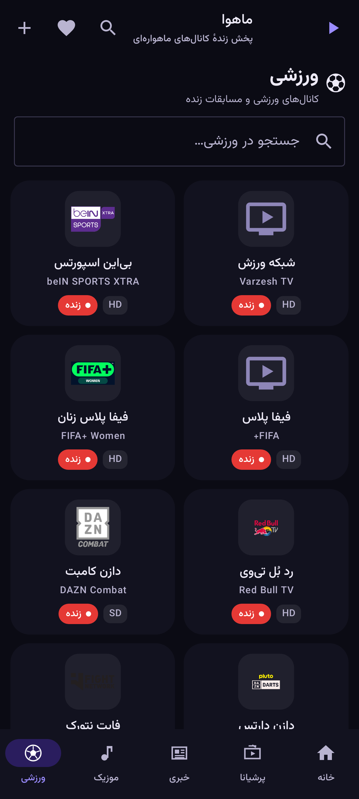 |

| منوی همبرگری و تنظیمات | رابط انگلیسی |
|---|---|
| 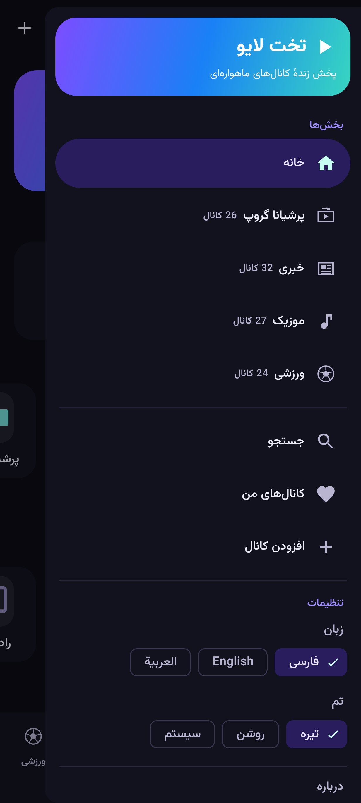 | 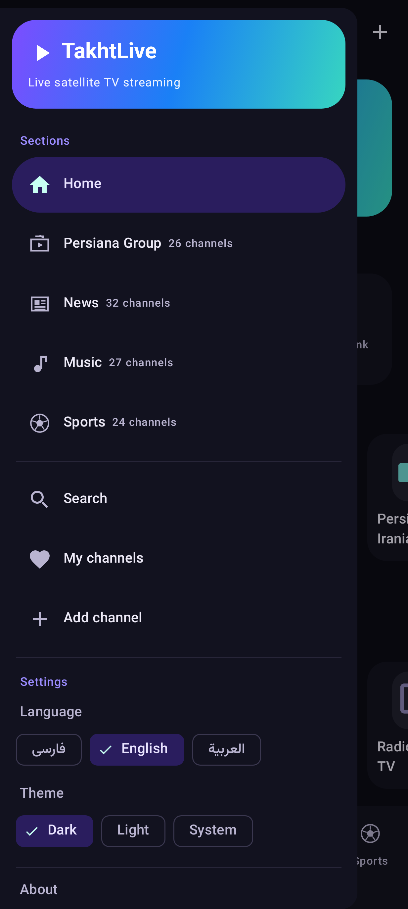 |

| تم روشن | رابط عربی |
|---|---|
| 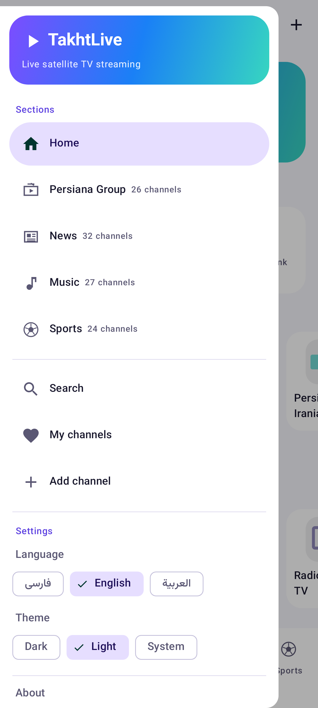 | 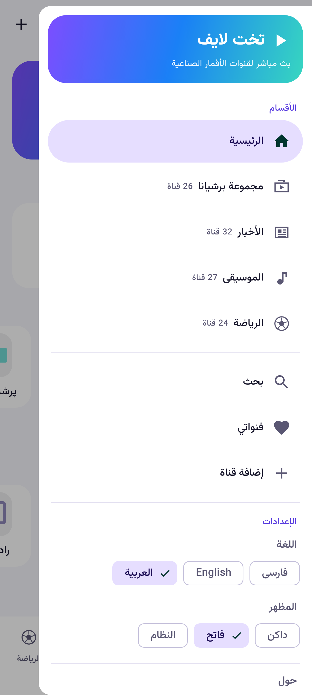 |

تصاویر اجرا روی **آدمک (Emulator) اندروید** هم در `docs/screenshots/emulator/` ذخیره می‌شوند.

---

## 🖥️ نسخهٔ ویندوز ۱۱

همین برنامه برای **ویندوز ۱۱** (دسکتاپ، ۶۴ بیتی) هم ساخته شده است — با همان **۱۰۹ کانال**، همان چهار بخش
(پرشیانا گروپ، خبری، موزیک، ورزشی)، همان سه زبان (فارسی/انگلیسی/عربی)، سه تم (تیره/روشن/سیستم) و امضای
`dmj74`. نسخهٔ ویندوز با **Electron** و **hls.js** ساخته می‌شود و از فایل `windows/assets/channels.json`
استفاده می‌کند که همان فهرست کانال‌های نسخهٔ اندروید است.

### 📥 نصب نسخهٔ ویندوز

1. به صفحهٔ انتشار بروید: <https://github.com/titanali1/takhtlive/releases/tag/windows-latest>
2. فایل **`TakhtLive-Setup-1.0.0.exe`** (نصب‌کننده) یا **`TakhtLive-1.0.0-portable.exe`** (بدون نصب) را دانلود کنید.
3. فایل را اجرا کنید. اگر ویندوز پیام SmartScreen داد: **More info ▸ Run anyway**.

نصب‌کننده در `%LOCALAPPDATA%\Programs\TakhtLive` نصب می‌شود و میان‌بر دسکتاپ و منوی استارت می‌سازد.
تنظیمات، علاقه‌مندی‌ها، کانال‌های اخیر و کانال‌های افزوده‌شدهٔ شما در
`%APPDATA%\TakhtLive\takhtlive-settings.json` ذخیره می‌شود و با به‌روزرسانی برنامه از بین نمی‌رود.

### 🖼 تصاویر نسخهٔ ویندوز

این تصاویر خودکار از اجرای واقعی رابط کاربری گرفته می‌شوند (کروم بی‌سر روی همان HTML/CSS/JS ای که
Electron بارگذاری می‌کند):

| صفحهٔ خانه | بخش پرشیانا گروپ |
|---|---|
| 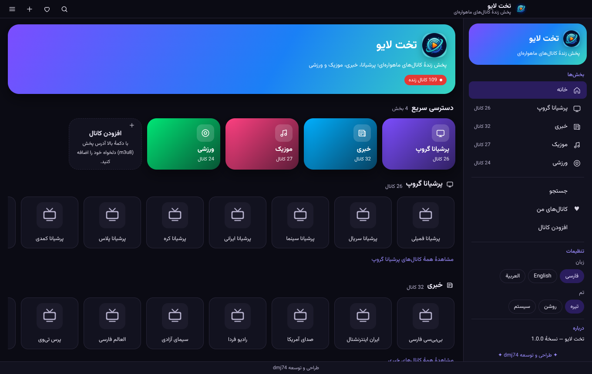 | 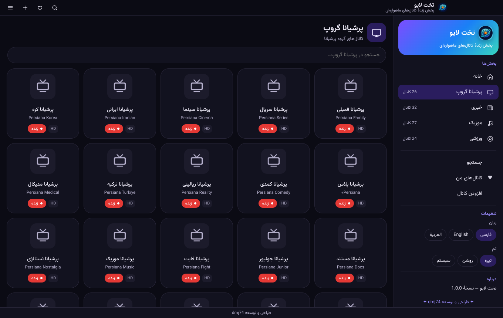 |

| پخش‌کنندهٔ زنده | منوی کشویی و تنظیمات |
|---|---|
| 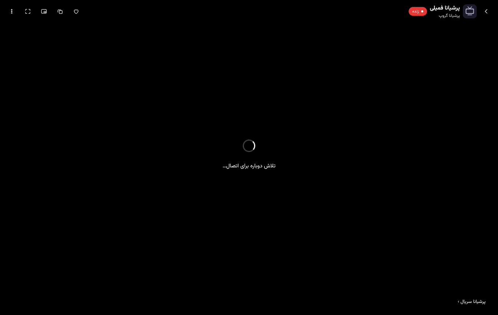 |  |

| رابط انگلیسی (تم روشن) | رابط عربی |
|---|---|
| 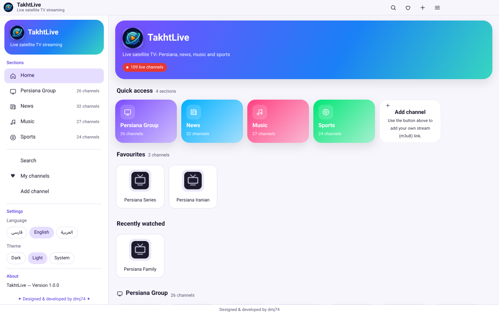 | 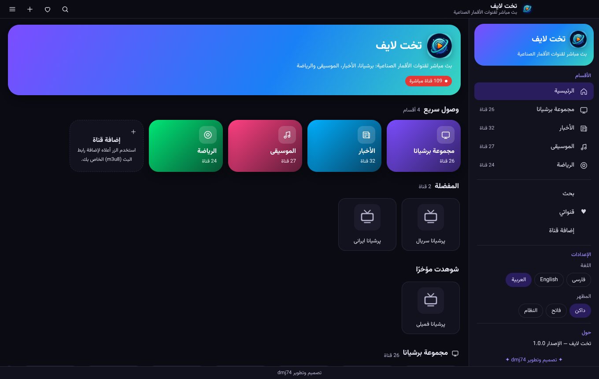 |

| جستجو | کانال‌های من |
|---|---|
| 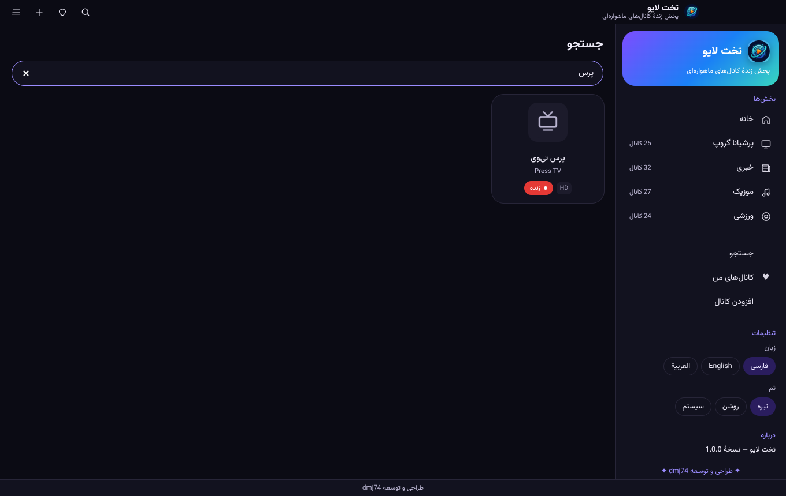 | 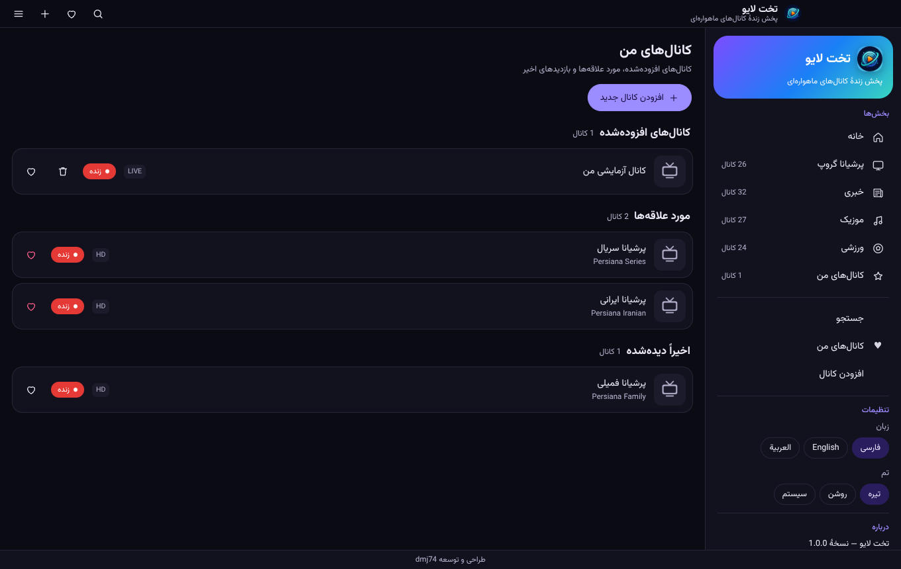 |

| افزودن کانال | بخش خبری |
|---|---|
| 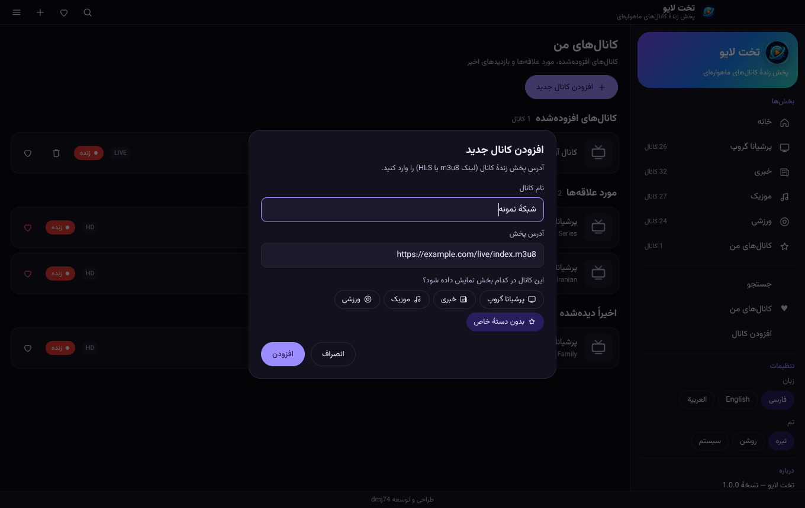 | 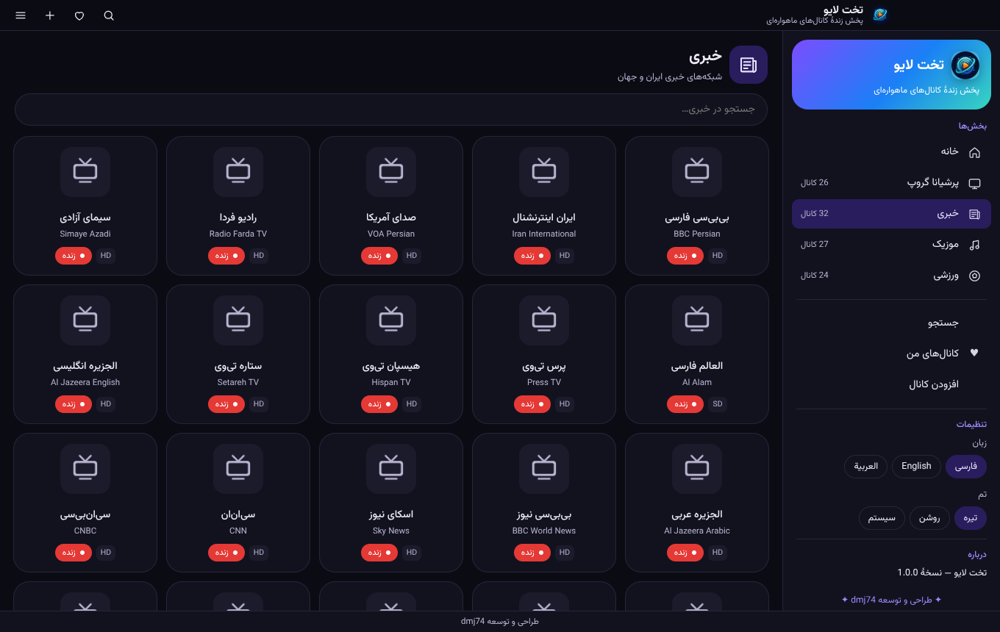 |

### 🛠️ ساخت نسخهٔ ویندوز از روی سورس

نیازمندی: **Node.js 22** (ویندوز، لینوکس یا مک). ساخت فایل نصب فقط روی ویندوز انجام می‌شود.

```bash
git clone https://github.com/titanali1/takhtlive.git
cd takhtlive
python3 tools/sync_windows_assets.py   # کانال‌ها، فونت وزیرمتن و آیکون از نسخهٔ اندروید
cd windows
npm install
npm start                              # اجرای برنامه روی همین سیستم
npm test                               # تست‌های فهرست کانال، ترجمه‌ها و تنظیمات
npm run screenshots                    # رندر خودکار همهٔ صفحه‌ها در docs/screenshots/windows
npm run build                          # ساخت نصب‌کننده و نسخهٔ portable (روی ویندوز)
```

خروجی ساخت: `windows/dist/TakhtLive-Setup-1.0.0.exe` و `windows/dist/TakhtLive-1.0.0-portable.exe`.
هر بار که کد روی شاخهٔ `main` تغییر کند، GitHub Actions این دو فایل را می‌سازد و در
Releases (تگ `windows-latest`) منتشر می‌کند.

## 🎨 لوگو و آیکون‌ها

لوگوی برنامه (بشقاب ماهواره‌ای با حلقه‌های موج و دکمهٔ پخش) در فایل
[`brand/takhtlive-mark.png`](brand/takhtlive-mark.png) نگهداری می‌شود و همهٔ آیکون‌ها از همان ساخته می‌شوند:

```bash
python3 tools/make_logo_assets.py
```

این دستور آیکون‌های اندروید (`mipmap-*` برای لانچر و آیکون تطبیقی)، آیکون ویندوز
(`icon.ico` و `icon-*.png`)، آیکون پنجرهٔ برنامه و تصویر بالای همین صفحه (`docs/logo.png`) را
از نو می‌سازد. اگر لوگو را تغییر دادید، فقط همان فایل را جای‌گذاری و این دستور را اجرا کنید.

## ✨ امکانات

- **چهار بخش مجزا** در نوار پایین برنامه: پرشیانا، خبری، موزیک، ورزشی (+ صفحهٔ خانه)
- **پخش زندهٔ HLS** با ExoPlayer/Media3 و کیفیت تطبیقی
- **اتصال دوبارهٔ خودکار (Auto-Reconnect)**: اگر استریم قطع شود، برنامه خودش تا ۶ بار تلاش می‌کند و فقط در صورت شکست پیام خطا نشان می‌دهد
- **جابه‌جایی سریع کانال (Zapping)**: دکمه‌های «کانال بعدی/قبلی» روی تصویر
- **مورد علاقه‌ها و اخیراً دیده‌شده‌ها** (ذخیره‌شده روی دستگاه)
- **جستجوی سراسری** در همهٔ بخش‌ها + جستجو در هر بخش
- **افزودن کانال دلخواه**: هر لینک `m3u8` را با نام دلخواه به هر بخش اضافه کنید
- **تصویر در تصویر (PiP)**، تغییر نسبت تصویر، اشتراک‌گذاری کانال و **پخش با VLC/پخش‌کنندهٔ خارجی**
- **منوی همبرگری (کشویی)** با دسترسی به همهٔ بخش‌ها، جستجو، کانال‌های من و **تنظیمات**
- **سه زبان: فارسی، انگلیسی، عربی** — از داخل منو، بدون بستن برنامه عوض می‌شود (راست‌به‌چپ/چپ‌به‌راست خودکار)
- **تم تیره، روشن و سیستم** — از داخل منو قابل تغییر
- **امضای dmj74** در پایین برنامه، منوی کشویی و انتهای فهرست‌ها
- **پشتیبانی از تلویزیون و باکس اندرویدی** (نصب روی Android TV، لانچر LEANBACK)
- رابط با فونت **وزیرمتن**؛ فارسی/عربی راست‌به‌چپ و انگلیسی چپ‌به‌راست
- **لوگوی اختصاصی** روی آیکون برنامه، بنر صفحهٔ خانه و منوی کشویی
- **نسخهٔ ویندوز ۱۱** با همین امکانات: پخش HLS با hls.js، جستجو، کانال‌های من، PiP، تمام‌صفحه و پخش با VLC

## 📥 نصب سریع (بدون دانش برنامه‌نویسی)

1. به بخش **Releases** مخزن بروید:  
   <https://github.com/titanali1/takhtlive/releases/latest>
2. فایل **`takhtlive-release.apk`** را دانلود کنید.
3. روی گوشی اندروید، فایل APK را باز کنید و اگر پیام «نصب از منابع ناشناس» آمد، اجازه دهید.
4. تمام! برنامه نصب می‌شود و می‌توانید کانال‌ها را تماشا کنید.

> فایل APK در هر بار تغییر کد به‌صورت خودکار توسط GitHub Actions ساخته و در Releases منتشر می‌شود
> (به‌همراه Artifact به نام `takhtlive-apk`).

## 🛠️ ساخت از روی سورس

نیازمندی‌ها: **JDK 17** و **Android SDK (API 35)**.

```bash
git clone https://github.com/titanali1/takhtlive.git
cd takhtlive
./gradlew :app:assembleDebug     # خروجی: app/build/outputs/apk/debug/app-debug.apk
./gradlew :app:assembleRelease   # خروجی: app/build/outputs/apk/release/app-release.apk
```

یا پروژه را در **Android Studio** باز کنید (File ▸ Open) و دکمهٔ Run را بزنید.

برای امضای نسخهٔ Release با کلید خودتان، فایل `keystore.properties` را در ریشهٔ پروژه بسازید:

```properties
storeFile=/path/to/keystore.jks
storePassword=...
keyAlias=...
keyPassword=...
```

بدون این فایل، نسخهٔ Release با کلید Debug امضا می‌شود تا روی گوشی نصب شود.

## 🗂 ساختار پروژه

```
app/src/main/
├── assets/channels.json          فهرست کانال‌ها (بخش‌ها + آدرس پخش + لوگو)
├── java/ir/takhtlive/tv/
│   ├── MainActivity.kt
│   ├── data/                     مدل داده، خواندن فهرست، تنظیمات کاربر
│   └── ui/                       صفحه‌ها: خانه، بخش‌ها، پخش‌کننده، جستجو، کانال‌های من
└── res/                          فونت وزیرمتن، آیکون‌ها، تم
brand/takhtlive-mark.png          لوگوی اصلی برنامه (تصویر مادر)
tools/make_logo_assets.py         ساخت همهٔ آیکون‌ها از لوگو (اندروید + ویندوز + README)
tools/curate_channels.py          ساخت channels.json از پلی‌لیست‌های عمومی
tools/sync_windows_assets.py      همگام‌سازی کانال‌ها/فونت با نسخهٔ ویندوز

windows/                          نسخهٔ دسکتاپ ویندوز ۱۱ (Electron)
├── src/                          پردازهٔ اصلی، پل preload، ذخیرهٔ تنظیمات، ترجمه‌ها
├── renderer/                     رابط کاربری (HTML/CSS/JS) + hls.js
├── assets/channels.json          همان فهرست کانال‌های نسخهٔ اندروید
├── tools/screenshots.js          رندر خودکار همهٔ صفحه‌ها (کروم بی‌سر)
└── electron-builder.yml          تنظیمات ساخت نصب‌کنندهٔ ویندوز (NSIS + portable)
```

### افزودن یا تغییر کانال‌ها

همهٔ کانال‌ها در فایل `app/src/main/assets/channels.json` هستند. برای افزودن کانال، یک عضو جدید به آرایهٔ
`channels` اضافه کنید:

```json
{
  "id": "my-channel",
  "name": "نام فارسی",
  "nameEn": "English Name",
  "category": "news",          // persiana | news | music | sports | custom
  "logo": "https://example.com/logo.png",
  "url": "https://example.com/live/stream.m3u8",
  "quality": "HD"
}
```

اپلیکیشن کانال‌های دستهٔ `custom` (کانال‌های افزوده‌شده توسط کاربر) را از حافظهٔ دستگاه می‌خواند،
بنابراین نیازی به تغییر کد ندارید.

## 🔎 منابع کانال‌ها

فهرست کانال‌ها از پلی‌لیست‌های عمومی و آزاد گردآوری شده است:

- [iptv-org/iptv](https://github.com/iptv-org/iptv) — دسته‌بندی‌های News، Music، Sports، Movies
- [Samhouston010/persian-tv](https://github.com/Samhouston010/persian-tv) — کانال‌های پرشیانا، خبری و موزیک فارسی

لوگوها از مخزن‌های عمومی (jnkie/iptv logos، persian-tv، ویکی‌مدیا) بارگذاری می‌شوند.
فونت: [Vazirmatn](https://github.com/rastikerdar/vazirmatn) (مجوز OFL).

## ⚠️ سلب مسئولیت

این برنامه فقط یک **پخش‌کننده** است و هیچ محتوایی را میزبانی یا بازپخش نمی‌کند. آدرس استریم‌ها از
منابع عمومی اینترنتی گردآوری شده و ممکن است هر زمان از دسترس خارج شوند. اگر استریمی کار نکرد،
از دکمهٔ «تلاش دوباره» استفاده کنید یا کانال دیگری را انتخاب کنید. مسئولیت استفاده از این برنامه
بر عهدهٔ کاربر است.

## 🩺 عیب‌یابی

| مشکل | راه‌حل |
|---|---|
| کانال وصل نمی‌شود | بعضی کانال‌ها فقط در کشور خاصی پخش می‌شوند یا موقتاً از دسترس خارج‌اند؛ کانال دیگری را امتحان کنید یا از منوی پخش‌کننده «پخش با VLC» را بزنید. |
| تصویر سیاه است ولی صدا دارد | در منوی سه‌نقطه، «بزرگ‌نمایی بدون حاشیه» را انتخاب کنید. |
| کانال مورد علاقه‌ام نیست | با دکمهٔ ➕ لینک `m3u8` آن را اضافه کنید. |
| APK نصب نمی‌شود | نصب از منابع ناشناس را برای مرورگر/مدیر فایل فعال کنید و نسخهٔ قبلی برنامه را پاک کنید. |
| ویندوز: پیام SmartScreen می‌آید | فایل نصب امضای تجاری ندارد؛ روی **More info** و بعد **Run anyway** بزنید. |
| ویندوز: صدا/تصویر قطع می‌شود | در منوی سه‌نقطهٔ پخش‌کننده «بزرگ‌نمایی بدون حاشیه» یا «کشیده تا لبه‌ها» را امتحان کنید؛ نسخهٔ دسکتاپ خودش تا ۶ بار اتصال را دوباره برقرار می‌کند. |
| ویندوز: می‌خواهم با VLC ببینم | در پخش‌کننده، از منوی سه‌نقطه «پخش با پخش‌کنندهٔ دیگر (VLC)» را بزنید. |
